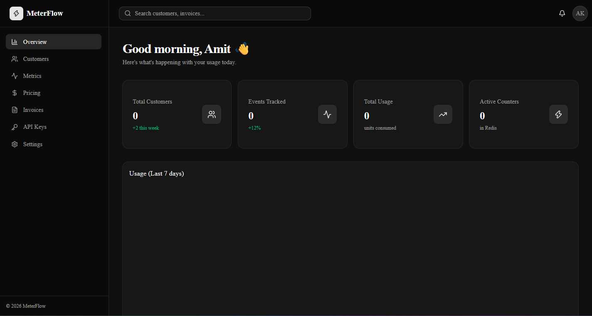
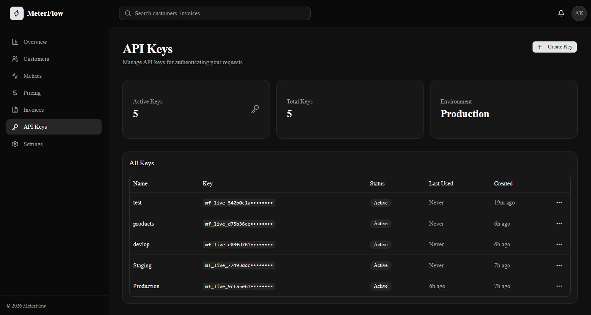
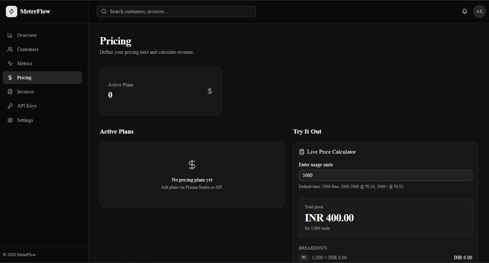
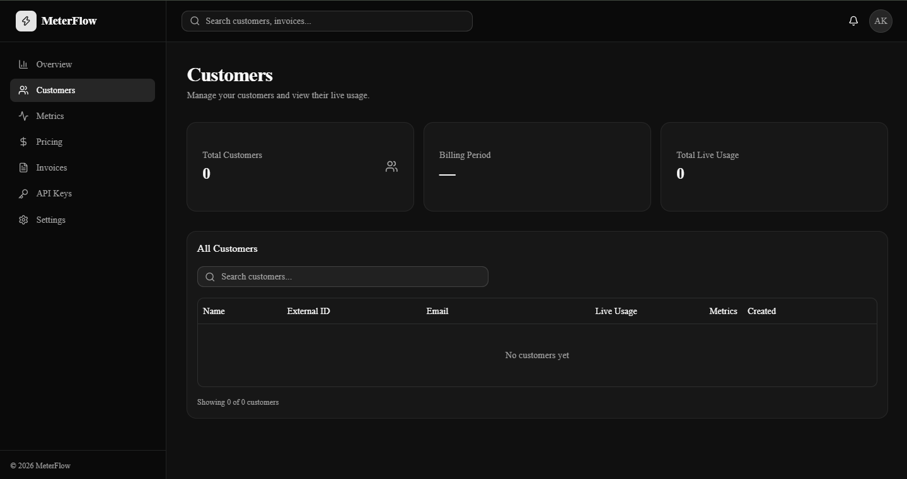
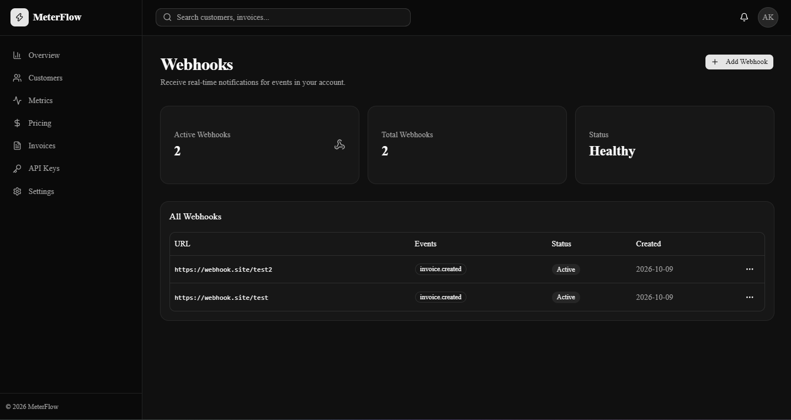

<div align="center">

# ⚡ MeterFlow

**Modern usage-based billing infrastructure for SaaS**

Event-driven metering, real-time counters, tiered pricing, and automated aggregation — similar to Stripe Meters, OpenMeter, and Lago.

[](https://meterflow-beta.vercel.app)
[](https://www.typescriptlang.org/)
[](https://nextjs.org/)
[](https://fastify.dev/)
[](https://www.prisma.io/)
[](https://redis.io/)

[Live Demo](https://meterflow-beta.vercel.app) · [Features](#-features) · [Architecture](#-architecture) · [Quick Start](#-quick-start) · [API Docs](#-api-usage)

</div>

---

## 🎯 What is MeterFlow?

MeterFlow is a **production-grade usage-based billing platform** that helps SaaS companies track, meter, and bill for their customers' API usage. Whether you're charging per API call, per GB stored, or per token — MeterFlow handles the ingestion, metering, aggregation, and invoicing.

Think of it as **"Stripe Meters"** or **"OpenAI Billing"** — built from scratch with a modern TypeScript stack.

### Why MeterFlow?

- 🔥 **Real-time metering** — track millions of events without slowing down
- 💰 **Flexible pricing** — flat, tiered, volume-based, or overage models
- ⚡ **Event-driven** — BullMQ queue decouples ingestion from processing
- 📊 **Live dashboard** — see usage update in real time
- 🔒 **Production-ready** — deployed on Vercel, Neon, and Upstash

---

## ✨ Features

### Core Platform

- 🔐 **Google OAuth authentication** — powered by NextAuth v5 with JWT sessions
- 🔑 **API Key management** — generate, list, revoke keys with SHA-256 hashing
- 📊 **Real-time metering** — Redis `INCRBYFLOAT` counters, sub-millisecond updates
- 💰 **Tiered pricing engine** — Stripe-style graduated pricing (e.g., first 1000 free, next 4000 @ ₹0.10)
- 🪝 **Webhooks** — subscribe to events with HMAC signatures
- ⚡ **Automated aggregation** — Redis → Postgres sync every 5 minutes via BullMQ cron
- 📈 **Live charts** — real-time usage visualization with Recharts
- 🎨 **Dark mode** — modern UI with shadcn/ui + Tailwind v4

### Engineering Highlights

- 🏗️ **Monorepo** — Turborepo + pnpm workspaces
- 📦 **5 workspaces** — `web`, `api`, `worker`, `database`, `shared`
- 🚀 **Zero TypeScript errors** — strict mode across all packages
- 🔄 **Idempotent** — duplicate events safely handled with idempotency keys
- 🛡️ **Multi-tenant** — organization-scoped data with row-level isolation
- ⚙️ **Event-driven architecture** — BullMQ for reliable queue processing
- 🧪 **Type-safe** — Zod schemas for API validation, Prisma for DB queries

---

## 🏗️ Architecture
┌──────────────────────────────────────────────────────────────────┐
│ │
│ ┌────────────┐ │
│ │ Client │──── POST /v1/events ───┐ │
│ │ (curl/SDK) │ (Bearer mf_live_xxx)│ │
│ └────────────┘ ▼ │
│ ┌─────────────────────┐ │
│ │ Fastify API │ │
│ │ (apps/api) │ │
│ │ - Auth middleware │ │
│ │ - Zod validation │ │
│ │ - SHA-256 hash │ │
│ └──────────┬──────────┘ │
│ │ │
│ ▼ │
│ ┌─────────────────────┐ │
│ │ BullMQ Queue │ │
│ │ (Upstash Redis) │ │
│ └──────────┬──────────┘ │
│ │ │
│ ▼ │
│ ┌─────────────────────┐ │
│ │ Worker │ │
│ │ (apps/worker) │ │
│ │ - Consume events │ │
│ │ - INCRBYFLOAT │ │
│ └──────────┬──────────┘ │
│ │ │
│ ┌──────────────────────────┼──────────────────────┐ │
│ ▼ ▼ ▼ │
│ ┌──────────────┐ ┌──────────────┐ ┌──────────┐ │
│ │ Redis │ │ Postgres │ │ Cron │ │
│ │ (Real-time) │ │ (Aggregated)│ │ (5 min) │ │
│ └──────────────┘ └──────────────┘ └──────────┘ │
│ │ │ │
│ └──────────┬───────────────┘ │
│ ▼ │
│ ┌─────────────────────┐ │
│ │ Next.js Dashboard │ │
│ │ (apps/web) │ │
│ │ - Real-time stats │ │
│ │ - Live charts │ │
│ │ - Pricing calc │ │
│ └─────────────────────┘ │
│ │
└──────────────────────────────────────────────────────────────────┘

text

### Data Flow

1. **Client** sends event → `POST /v1/events` with Bearer token
2. **API** validates API key against Postgres, queues event to BullMQ
3. **Worker** consumes event, increments Redis counter atomically
4. **Cron** runs every 5 min → syncs Redis counters to Postgres `usage_records`
5. **Dashboard** combines Redis (real-time) + Postgres (historical) for display

---

## 🛠️ Tech Stack

| Layer | Technology | Purpose |
|-------|-----------|---------|
| **Frontend** | Next.js 15 (App Router) | Dashboard UI, SSR, API routes |
| **UI** | shadcn/ui + Tailwind v4 | Modern, accessible components |
| **Charts** | Recharts | Real-time usage visualization |
| **Auth** | NextAuth v5 + Google OAuth | Authentication with JWT sessions |
| **API** | Fastify + Zod | High-performance event ingestion |
| **Queue** | BullMQ | Reliable event processing |
| **Worker** | Node.js | Background event consumer |
| **Database** | Neon Postgres + Prisma | Persistent storage (15 tables) |
| **Cache** | Upstash Redis | Real-time counters + queue |
| **Monorepo** | Turborepo + pnpm | Fast builds, workspace management |
| **Deploy** | Vercel + Neon + Upstash | Zero-cost production stack |

---

## 📸 Screenshots

### Dashboard Overview


*Real-time stats, usage chart, and recent events.*

### API Keys Management


*Generate, list, and revoke API keys with SHA-256 hashing.*

### Live Pricing Calculator


*Stripe-style tiered pricing calculator with instant feedback.*

### Customers


*Customer list with live usage from Redis.*

### Webhooks


*Event subscriptions with HMAC secrets.*

---

## 🚀 Quick Start

### Prerequisites

- **Node.js** 20+
- **pnpm** 9+ (`npm install -g pnpm`)
- **Postgres** (free tier: [Neon](https://neon.tech))
- **Redis** (free tier: [Upstash](https://upstash.com))
- **Google OAuth** credentials ([Console](https://console.cloud.google.com))

### Installation

```bash
# 1. Clone the repository
git clone https://github.com/iamdeveloper17/meterflow.git
cd meterflow

# 2. Install dependencies
pnpm install

# 3. Setup environment variables
cp .env.example .env
# Edit .env with your credentials:
#   - DATABASE_URL, DIRECT_URL (Neon Postgres)
#   - REDIS_URL (Upstash)
#   - AUTH_SECRET (generate: openssl rand -base64 32)
#   - GOOGLE_CLIENT_ID, GOOGLE_CLIENT_SECRET

# 4. Generate Prisma client
pnpm db:generate

# 5. Run migrations
pnpm db:migrate

# 6. Start all apps in parallel
pnpm dev
Apps running at:

🎨 Web: http://localhost:3000

🚀 API: http://localhost:3001

⚙️ Worker: background process

📖 API Usage
1. Create an API Key
Login at http://localhost:3000

Go to API Keys → Create Key

Copy the key (mf_live_...) — shown only once

2. Send a Single Event
bash
curl -X POST http://localhost:3001/v1/events \
  -H "Authorization: Bearer mf_live_xxx" \
  -H "Content-Type: application/json" \
  -d '{
    "customerId": "cust_123",
    "metric": "api_calls",
    "value": 1
  }'
Response:

json
{
  "status": "queued",
  "eventId": "evt_abc123"
}
3. Send Batch Events
bash
curl -X POST http://localhost:3001/v1/events/batch \
  -H "Authorization: Bearer mf_live_xxx" \
  -H "Content-Type: application/json" \
  -d '{
    "events": [
      { "customerId": "cust_123", "metric": "api_calls", "value": 5 },
      { "customerId": "cust_456", "metric": "storage_gb", "value": 2.5 }
    ]
  }'
4. Query Usage
bash
curl "http://localhost:3001/v1/usage/cust_123?organizationId=org_xxx" \
  -H "Authorization: Bearer mf_live_xxx"
5. Idempotency
Duplicate events are safe — pass an idempotencyKey:

bash
curl -X POST http://localhost:3001/v1/events \
  -H "Authorization: Bearer mf_live_xxx" \
  -H "Content-Type: application/json" \
  -d '{
    "customerId": "cust_123",
    "metric": "api_calls",
    "value": 1,
    "idempotencyKey": "unique-tx-id-12345"
  }'
🗄️ Database Schema
15 tables across 4 domains:

Domain	Tables
Auth	users, accounts, sessions
Multi-tenancy	organizations, organization_members, api_keys
Metering	customers, metrics, usage_records, raw_events
Billing	pricing_plans, plan_prices, invoices
Integrations	webhooks, audit_logs
📂 Project Structure
text
meterflow/
├── apps/
│   ├── web/                  # Next.js dashboard (port 3000)
│   │   ├── src/app/          # App Router pages
│   │   ├── src/components/   # UI + business components
│   │   └── src/lib/          # Auth, API keys, utilities
│   │
│   ├── api/                  # Fastify ingestion API (port 3001)
│   │   └── src/
│   │       ├── routes/       # /v1/events, /v1/usage
│   │       ├── middleware/   # API key auth
│   │       ├── queue/        # BullMQ producer
│   │       └── services/     # Business logic
│   │
│   └── worker/               # BullMQ worker
│       └── src/
│           ├── workers/      # Metering worker
│           ├── jobs/         # Aggregation job
│           ├── schedulers/   # Cron scheduler
│           └── services/     # Counter, aggregation
│
├── packages/
│   ├── database/             # Prisma schema + client
│   │   └── prisma/
│   │       └── schema.prisma
│   │
│   └── shared/               # Shared utilities
│       └── src/
│           ├── queue/        # Queue definitions
│           ├── pricing/      # Tiered calculator
│           ├── types/        # TypeScript types
│           └── validation/   # Zod schemas
│
├── turbo.json                # Turborepo configuration
├── pnpm-workspace.yaml       # Workspace definition
└── tsconfig.json             # Root TypeScript config
⚙️ Available Scripts
From the repository root:

bash
# Development
pnpm dev              # Start all apps in parallel
pnpm dev --filter=web # Start only the web app

# Building
pnpm build            # Build all apps and packages
pnpm build --filter=web

# Database
pnpm db:generate      # Generate Prisma Client
pnpm db:migrate       # Run migrations
pnpm db:studio        # Open Prisma Studio
pnpm db:seed          # Seed database

# Utilities
pnpm lint             # Lint all packages
pnpm format           # Format with Prettier
pnpm clean            # Clean all build artifacts
🔐 Environment Variables
See .env.example for the full list.

Required:

Variable	Description
DATABASE_URL	Neon Postgres pooled URL
DIRECT_URL	Neon Postgres direct URL (for migrations)
REDIS_URL	Upstash Redis URL (rediss://...)
AUTH_SECRET	Random 32-byte secret
AUTH_URL	Public app URL
GOOGLE_CLIENT_ID	Google OAuth client ID
GOOGLE_CLIENT_SECRET	Google OAuth client secret
🎯 Roadmap
☑ Event ingestion pipeline — Fastify + BullMQ + Redis
☑ Real-time metering — INCRBYFLOAT counters
☑ Automated aggregation — 5-min cron (Redis → Postgres)
☑ Tiered pricing engine — Stripe-style graduated
☑ Google OAuth — NextAuth v5 + JWT sessions
☑ API Key management — SHA-256 hashed keys
☑ Webhooks — Event subscriptions with HMAC secrets
☑ Live dashboard — Recharts + real-time stats
☑ Deployed to Vercel — Production-ready
□ API + Worker deploy — Railway
□ Invoice generation — PDF exports
□ Stripe integration — Automated charging
□ Public SDK — npm package for easy integration
□ Analytics — Cohort analysis, retention
□ Alerting — Usage threshold notifications
🤝 Contributing
Contributions are welcome! Please:

Fork the repository

Create a feature branch (git checkout -b feature/amazing-feature)

Commit your changes (git commit -m 'feat: add amazing feature')

Push to the branch (git push origin feature/amazing-feature)

Open a Pull Request

📄 License
This project is licensed under the MIT License — see the LICENSE file for details.

👨‍💻 Author
Amit Kumar

GitHub: @iamdeveloper17

Project: meterflow

🙏 Acknowledgments
Stripe Meters — Design inspiration

OpenMeter — Open-source alternative

Turborepo — Monorepo tooling

shadcn/ui — Component library

<div align="center">
⭐ If you find this project useful, please give it a star! ⭐

Built with ❤️ by Amit Kumar

</div> ```
Save karo (Ctrl+S).